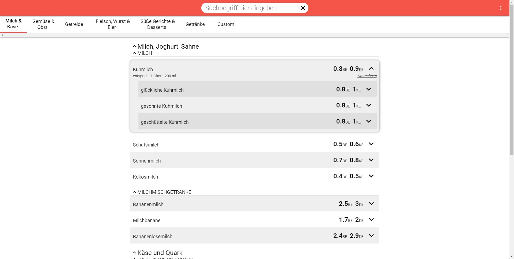
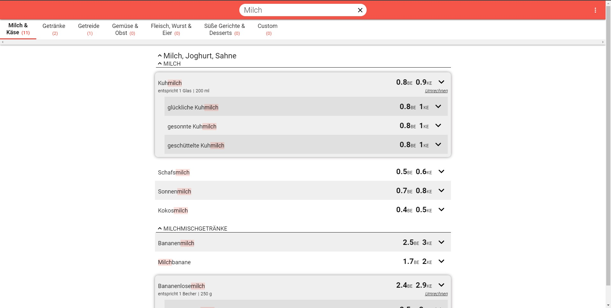
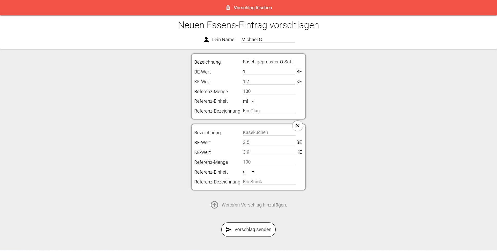
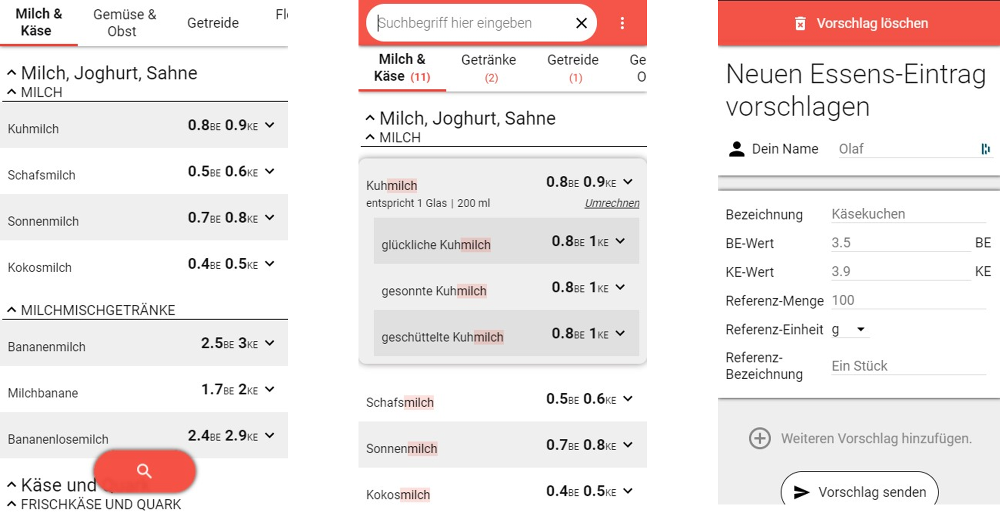
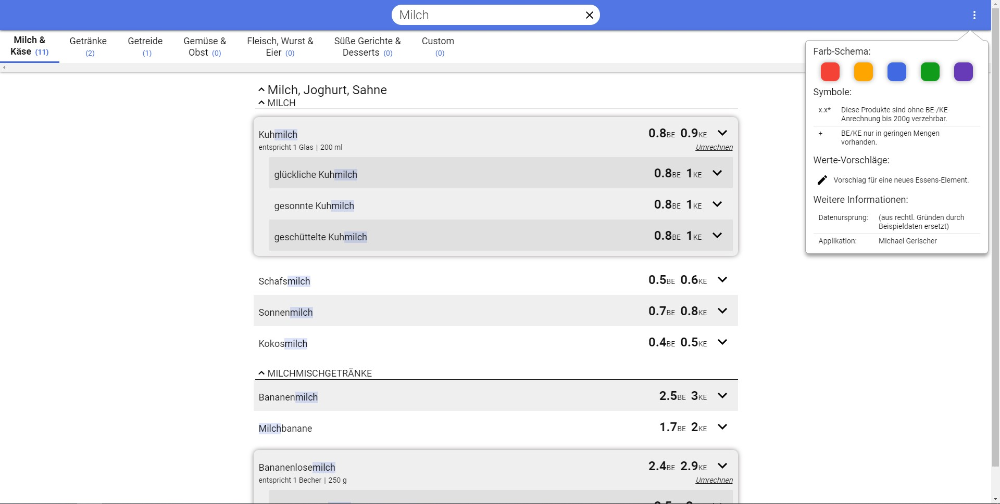

# Diabetes-Reference
## General
A web application intended to support diabetics handling their everyday life. It allows them to find information about the food they eat in order to manage it properly in the face of the disease. 

This web-project was created by me in the third semester of my study. Since then, nothing has changed considering the feature set and code quality. Unfortunately, the original data-set is not available for the public so for this repo dummy data will be used instead. This may change in the future.

Currently, the application gets updated. New technologies and features will be implemented. The current concepting progress can be viewed on [the corresponding Miro board](https://miro.com/app/board/o9J_ljjXDGI=/?invite_link_id=727903907767).

## Functionality and screenshots
### Landing page
The landing page contains the core feature of the application. Here, all available food and drinks get displayed grouped by categories, groups and subgroups. The categories are the coarsest classification of food and drinks whereas, subgroups are the finest. If an element has several variations, they are represented as children of the parent element. 

### Search

The search bar at the top provides options to filter elements by keywords. All matches get highlighted to enable a quick finding of the right item. Also, the categories get sorted by their number of matches. The corresponding result get printed along with the category name. 

### Custom proposals

Obviously, not every existing food and drink can be found in this dataset. However, there is a form to propose a custom entry to extend the dataset. The requests get stored in a text file which I will check. If it contains useful data I will add the entries to the dataset. The reason for having such an unhandy process is based on the production environment. A simple webserver was provided by the university, so the easiest way for me was handling this feature by a PHP-file. Also, since I’m not a food specialist, these items get grouped in an extra category with the note of lacking validation.

### Responsive layout

Since, most of the people don’t carry their notebook with them while eating food, the target devices are mobiles. The responsive design ensures for these use cases a better user experience. Especially, the search bar shrunk to the size of a small button on the bottom of the page to save valuable space on mobile devices. 

### Color theme

This feature was just added to address the color preferences of users. The color accents will be adjusted by switching the theme.

